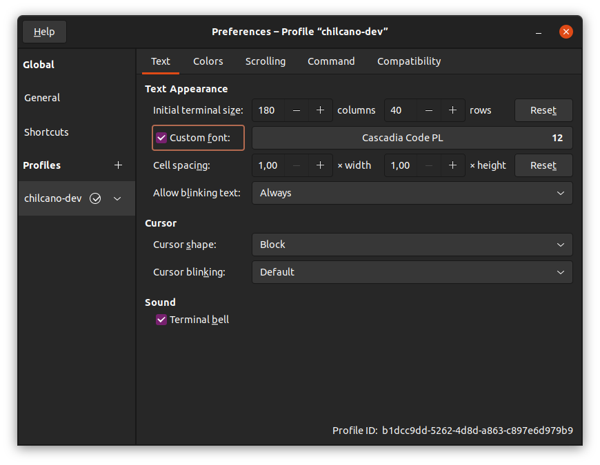

# Custom Prompt in Ubuntu with Powerline Go


## The short path.

If you don't want go through below steps, I've created a [bash script to automate the process and get the same results](https://raw.githubusercontent.com/chilcano/how-tos/main/src/custom_prompt_with_powerline_go.sh). 

```sh
$ sudo apt -yqq install golang-go curl jq git unzip wget
$ curl -s https://raw.githubusercontent.com/chilcano/how-tos/main/src/custom_prompt_with_powerline_go.sh | bash
```

The above script will:

1. Install Golang.
2. Install [Powerline-Go](https://github.com/justjanne/powerline-go).
3. Create the `powerline-go-loader.sh` to configure the Linux Prompt.
4. Install The Microsoft [Cascadia Code Fonts includes the Powerline glyphs](https://github.com/microsoft/cascadia-code)
5. Apply all configuration.
6. Once completed, tweak the configuration in your OS Terminal (step 2) and VS Code integrated terminal (step 1).

## The long path - Steps

### 1) Install Go.

```sh
$ sudo apt install -y golang-go
```

### 2) Install Powerline-Go.

```sh
$ go get -u github.com/justjanne/powerline-go
```

You will have this warning message:
```sh
...
go get: installing executables with 'go get' in module mode is deprecated.
	Use 'go install pkg@version' instead.
	For more information, see https://golang.org/doc/go-get-install-deprecation
	or run 'go help get' or 'go help install'.
```

### 3) Set the Ubuntu prompt configuration.

The delimiting identifier is quoted (`'EOF'`) to avoid the shell substitutes all variables, commands and special characters before passing the here-document lines to the command.   
We are not appending a minus sign to the redirection operator `<<-` to all leading tab characters to be considered (Info: https://linuxize.com/post/bash-heredoc/).  

```sh
$ cat << 'EOF' > powerline-go-loader.sh
#!/bin/bash
GOPATH=$HOME/go
export PATH="$GOPATH/bin:$PATH"

function _update_ps1() {
    PS1="$($GOPATH/bin/powerline-go -error $?)"
}
if [ "$TERM" != "linux" ] && [ -f "$GOPATH/bin/powerline-go" ]; then
    PROMPT_COMMAND="_update_ps1; $PROMPT_COMMAND"
fi
EOF

$ chmod +x powerline-go-loader.sh
$ mv -f powerline-go-loader.sh $HOME/powerline-go-loader.sh
$ echo '# Loading Powerline-Go' >> ~/.bashrc
$ echo '. $HOME/powerline-go-loader.sh' >> ~/.bashrc
```

### 4) Installing Fonts with Powerline glyphs.  

The Microsoft Cascadia Code Fonts includes the Powerline glyphs [here](https://github.com/microsoft/cascadia-code), we need to download and install it in your O.S.  
The Powerline-Go will work with any fonts with already embeded Powerline glyphs. In [Nerd Fonts](https://www.nerdfonts.com) you can get some fonts. 
```sh
$ PL_FONTS_URL=$(curl -s https://api.github.com/repos/microsoft/cascadia-code/releases/latest | jq -r -M '.assets[].browser_download_url')
$ PL_FONTS_FILENAME="${PL_FONTS_URL##*/}"
// PL_FONTS_FILENAME=$(basename -- "$PL_FONTS_URL")
$ PL_FONTS_NAME="${PL_FONTS_FILENAME%.*}"
$ PL_FONTS_EXTENSION="${PL_FONTS_FILENAME##*.}"

$ mkdir -p $HOME/.fonts/powerline/$PL_FONTS_NAME
$ wget -q $PL_FONTS_URL
$ sudo apt install unzip -y
$ unzip -oq $PL_FONTS_NAME -d $HOME/.fonts/powerline/$PL_FONTS_NAME
$ fc-cache -f $HOME/.fonts
```   

### 5) Reload the init bash script to apply the new styled Ubuntu prompt.

```sh
$ . ~/.bashrc
```
You should see below image with full prompt in 1 line:


### 6) Customize the Ubuntu prompt

I'd like to show the prompt in a two lines, first line for the full path and second line only with cursor. Then, to do that let's modify the `powerline-go-loader.sh`.  
The `powerline-go -help` command will show all parameters to customize your prompt. In this specific case I'll use `-newline`.
```sh
$ nano $HOME/powerline-go-loader.sh

#!/bin/bash
GOPATH=$HOME/go
export PATH="$GOPATH/bin:$PATH"

function _update_ps1() {
    PS1="$($GOPATH/bin/powerline-go -newline -error $?)"
}
if [ "$TERM" != "linux" ] && [ -f "$GOPATH/bin/powerline-go" ]; then
    PROMPT_COMMAND="_update_ps1; $PROMPT_COMMAND"
fi
```

Once changed, reload the init bash script.
```sh
$ . ~/.bashrc
```
You should see below images with a prompt in 2 lines.  

In [Code-Server Terminal](https://github.com/cdr/code-server):
  

In [Fluent Terminal](https://github.com/felixse/FluentTerminal):
  

In [Windows Terminal](https://github.com/microsoft/terminal):
  

## Load custom Fonts in your Terminal

### 1. VS Code or Code-Server integrated Terminal

Edit the `settings.json` and make sure you load the `Cascadia Mono PL` font already installed in your O.S.:
```json
    "terminal.integrated.fontFamily": "'Cascadia Mono PL'"
```
Here, a sample `settings.json` you can use in your VS Code or Code-Server:
```json
{
    "explorer.confirmDelete": false,
    "workbench.colorTheme": "Default Light+",
    "workbench.colorCustomizations": {
        "terminal.selectionBackground": "#0088ff",
        "terminal.foreground":"#ffffff",
        "terminal.border": "#ff0000",
        "terminalCursor.background":"#605852",
        "terminalCursor.foreground":"#f30be7",        
        "terminal.background":"#000000",
        "editor.background": "#ffffff",
        "editor.foreground": "#000000",
        "editor.lineHighlightBorder": "#0088ff",
        "editor.lineHighlightBackground": "#ffffff",
        "editor.rangeHighlightBackground": "#55ca55",
        "panel.background": "#dedede",
        "tab.hoverBackground": "#dedede"
    },
    "window.zoomLevel": 0,
    "editor.fontSize": 14,
    "editor.suggestFontSize": 10,
    "debug.console.fontSize": 12,
    "markdown.preview.fontSize": 14,
    "terminal.integrated.fontSize": 14,
    "terminal.integrated.cursorBlinking": true,
    //"terminal.integrated.fontFamily": "Consolas, 'SauceCodePro NF', 'SourceCodePro+Powerline+Awesome Regular', 'MesloLGM NF'",
    "terminal.integrated.fontFamily": "'Cascadia Mono PL'",
}
```

### 2. Gnome Terminal

The Gnome Terminal doesn't require any special configuration, the default configuration `Font: Monospace` will work, however if you want change the fonts, you can do it.  
First of all, install `gnome-tweaks`, it will allow you force the load of fonts in your system.
```sh
$ sudo apt -y install gnome-tweaks
```
Now, go to `Gnome Terminal > Preferences` and select the installed Fonts.



### Reference:
- [Microsoft Tutorial: Set up Powerline in Windows Terminal](https://docs.microsoft.com/en-us/windows/terminal/tutorials/powerline-setup)
- [A Powerline style prompt for your shell](https://github.com/justjanne/powerline-go)
- [Microsoft Cascadia Code with Powerline glyphs](https://github.com/microsoft/cascadia-code)
