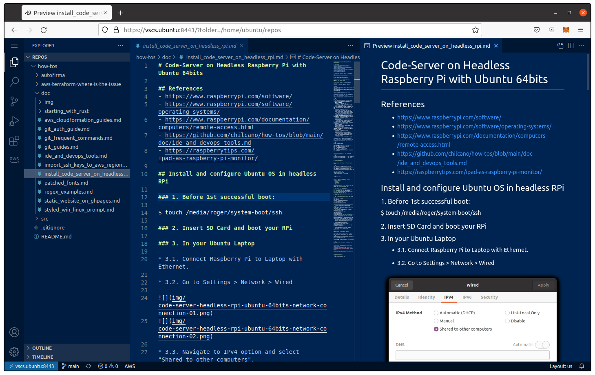

# Code-Server on Headless Raspberry Pi with Ubuntu OS 64bits

## Install and configure Ubuntu OS in headless RPi 

Follow this guide: [Install Raspbian OS and Ubuntu 64bits on Raspberry Pi 3B+ in headless mode](raspberry_pi_getting_started.md)

## Install Code-Server

### 1. Install Code-Server on RPi with Ubuntu 64bits

```sh
wget -qN https://raw.githubusercontent.com/chilcano/how-tos/main/src/code_server_install.sh

wget -qN https://raw.githubusercontent.com/chilcano/how-tos/main/src/code_server_remove.sh

sudo apt -y install jq

chmod +x code_server_*.sh
```

As we are going to install Code-Server in our Home LAN, TLS will not be necessary and `--arch=arm` means the bash script will download the Code-Server version for ARM Architectures (Raspberry Pi). 

```sh
. code_server_install.sh --arch=arm --tls=no
```

You will see this:
```sh
...

Created a new certificate valid for the following names 📜
 - "vscs.ubuntu"
 - "ubuntu"
 - "localhost"
 - "127.0.0.1"
 - "::1"

The certificate is at "./vscs.ubuntu+4.pem" and the key at "./vscs.ubuntu+4-key.pem" ✅

It will expire on 4 March 2024 🗓

mv: 'vscs.ubuntu+4-key.pem' and '/home/ubuntu/vscs.ubuntu+4-key.pem' are the same file
mv: 'vscs.ubuntu+4.pem' and '/home/ubuntu/vscs.ubuntu+4.pem' are the same file

>> Tweaking '~/.config/code-server/config.yaml' to enable TLS. \n

>> The '~/.config/code-server/config.yaml' final is: 
-----------------------------------------------
bind-addr: 0.0.0.0:8080
auth: password
password: 68c2316fa531707fa4caeac9
disable-telemetry: true
-----------------------------------------------
>> Trust on the Root CA crt generated by 'mkcert'.
>> You have to install it in your browser as trusted CA and add 'ubuntu 192.168.1.44' in your '/etc/hosts' file.
>> You can found the Root CA here: ~/.local/share/mkcert/rootCA.pem 

>> Installing Extension: Shan.code-settings-sync. 
Installing extensions...
Installing extension 'shan.code-settings-sync'...
Extension 'shan.code-settings-sync' v3.4.3 was successfully installed.

Get a trusted Gist ID to restore extensions and configurations through Settings-Sync extension:
	 Gist URL: https://gist.github.com/chilcano/b5f88127bd2d89289dc2cd36032ce856 
	 Gist ID: b5f88127bd2d89289dc2cd36032ce856 

>> Installing Extension from VSIX: AmazonWebServices.aws-toolkit-vscode. 
Installing extensions...
Extension 'aws-toolkit-vscode-1.34.0.vsix' was successfully installed.

>> Restarting Code-Server to apply changes. 
>> Code-Server 3.12.0 was installed successfully. 
```

### 2. Connect to Code-Server remotely

* 2.1. Copy the certificate from RPi to Laptop.

If you have connected the RPi directly to your Laptop, in your Laptop execute this:

```sh
scp ubuntu@10.42.0.159:/home/ubuntu/.local/share/mkcert/rootCA.pem rootCA.pem
```
But if you have connected the RPi to your LAN, then execute this:

```sh
scp ubuntu@192.168.1.160:/home/ubuntu/.local/share/mkcert/rootCA.pem rootCA.pem
```

* 2.2. Add RPi IP address to Hosts file in Laptop.

```sh
echo "10.42.0.159	vscs.ubuntu" | sudo tee -a /etc/hosts
echo "192.168.1.160	vscs.ubuntu" | sudo tee -a /etc/hosts
```

* 2.3. Install above Code-Server rootCA into Laptop's browser

* 2.4. Open the Code-Server URL [`https://vscs.ubuntu:8443`](https://vscs.ubuntu:8443) in your browser.

* 2.5. Enter the Code-Server Password generated during the installation process.

Now, you should see this:




### Remove Code-Server

```sh
. code_server_remove_rpi.sh
```

## References

- https://www.raspberrypi.com/documentation/computers/configuration.html
- https://www.raspberrypi.com/documentation/computers/remote-access.html
- [Configure Wi-Fi or Ethernet on Ubuntu for Raspberry Pi](https://ubuntu.com/tutorials/how-to-install-ubuntu-on-your-raspberry-pi#3-wifi-or-ethernet)
- https://github.com/chilcano/how-tos/blob/main/doc/ide_and_devops_tools.md
- https://raspberrytips.com/ipad-as-raspberry-pi-monitor/
- https://hrushi-deshmukh.medium.com/getting-started-with-raspberry-pi-using-command-line-only-18aab667f183
