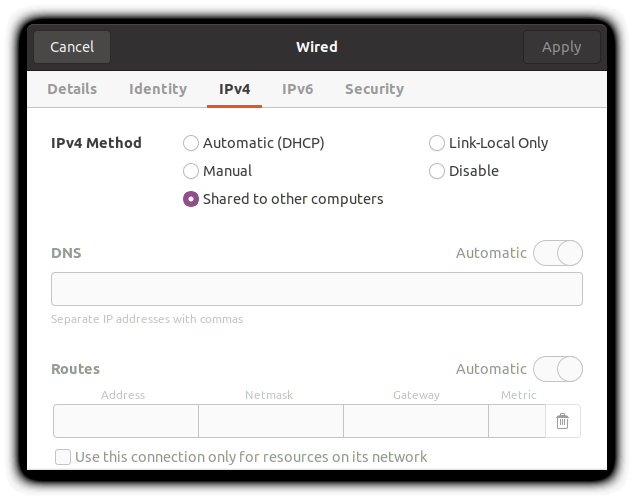
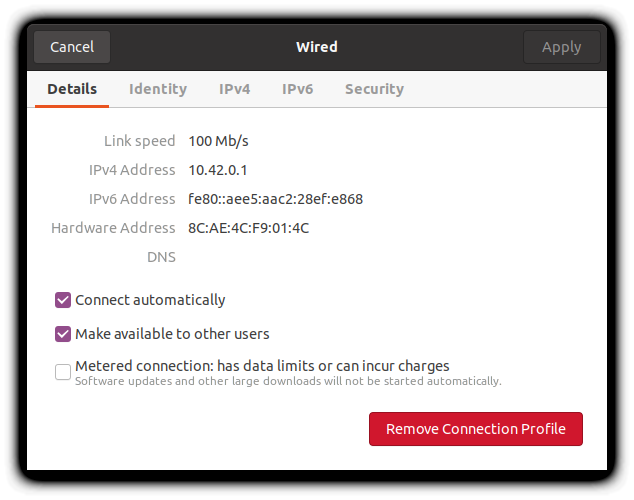

# Code-Server on Headless Raspberry Pi with Ubuntu 64bits

## References
- https://www.raspberrypi.com/software/
- https://www.raspberrypi.com/software/operating-systems/
- https://www.raspberrypi.com/documentation/computers/remote-access.html
- https://github.com/chilcano/how-tos/blob/main/doc/ide_and_devops_tools.md
- https://raspberrytips.com/ipad-as-raspberry-pi-monitor/
- https://hrushi-deshmukh.medium.com/getting-started-with-raspberry-pi-using-command-line-only-18aab667f183
- https://www.makeuseof.com/tag/install-operating-system-raspberry-pi/

## Install and configure Ubuntu OS in headless RPi 

### 1. Bootstraping OS image in Raspberry Pi

You can use this bash script to bootstrap an OS (Ubuntu, Raspbian, Debian or Raspberry Pi OS) in your Raspberry Pi. 
The next bash script will enable SSH and WIFI when burning the OS image in your SD card. Only follow the next steps:

```sh
$ wget -qN https://raw.githubusercontent.com/chilcano/how-tos/master/src/bootstrap_rpi_img.sh

$ chmod +x bootstrap_rpi_img.sh

$ . bootstrap_rpi_img.sh \
 --if=/media/roger/Transcend/isos-images/rpi/2021-10-30-raspios-bullseye-armhf.zip \
 --of=/dev/sdc \
 --ssh=enable \
 --wifi=enable
```

### 2. Insert SD Card and boot your RPi


### 3. RPi connected directly to Ubuntu Laptop

* 3.1. Connect Raspberry Pi to Laptop with Ethernet.

* 3.2. Go to Settings > Network > Wired.




* 3.3. Navigate to `IPv4` option and select `Shared to other computers`.

* 3.4. Open Terminal and type next command (`$ ip a s`) to get the IP address for the `enx<MAC-ADDRESS>` Network Interface. Also you can see it in `Wired Settings > IPv4`. 

```sh
$ ip a s
1: lo: <LOOPBACK,UP,LOWER_UP> mtu 65536 qdisc noqueue state UNKNOWN group default qlen 1000
    link/loopback 00:00:00:00:00:00 brd 00:00:00:00:00:00
    inet 127.0.0.1/8 scope host lo
       valid_lft forever preferred_lft forever
    inet6 ::1/128 scope host 
       valid_lft forever preferred_lft forever
2: wlp2s0: <BROADCAST,MULTICAST,UP,LOWER_UP> mtu 1500 qdisc noqueue state UP group default qlen 1000
    link/ether 90:78:41:13:cb:e9 brd ff:ff:ff:ff:ff:ff
    inet 192.168.1.152/24 brd 192.168.1.255 scope global dynamic noprefixroute wlp2s0
       valid_lft 72207sec preferred_lft 72207sec
    inet6 fe80::89c7:1f89:b09b:70ab/64 scope link noprefixroute 
       valid_lft forever preferred_lft forever
3: docker0: <NO-CARRIER,BROADCAST,MULTICAST,UP> mtu 1500 qdisc noqueue state DOWN group default 
    link/ether 02:42:36:d4:eb:b2 brd ff:ff:ff:ff:ff:ff
    inet 172.17.0.1/16 brd 172.17.255.255 scope global docker0
       valid_lft forever preferred_lft forever
4: br-e62192fa6741: <NO-CARRIER,BROADCAST,MULTICAST,UP> mtu 1500 qdisc noqueue state DOWN group default 
    link/ether 02:42:c1:fc:b6:17 brd ff:ff:ff:ff:ff:ff
    inet 172.18.0.1/16 brd 172.18.255.255 scope global br-e62192fa6741
       valid_lft forever preferred_lft forever
6: enx8cae4cf9014c: <BROADCAST,MULTICAST,UP,LOWER_UP> mtu 1500 qdisc fq_codel state UP group default qlen 1000
    link/ether 8c:ae:4c:f9:01:4c brd ff:ff:ff:ff:ff:ff
    inet 10.42.0.1/24 brd 10.42.0.255 scope global noprefixroute enx8cae4cf9014c
       valid_lft forever preferred_lft forever
    inet6 fe80::aee5:aac2:28ef:e868/64 scope link noprefixroute 
       valid_lft forever preferred_lft forever
```

* 3.5. With that IP address (enx8cae4cf9014c with 10.42.0.1/24), run the next command to scan all active IP addresses under the 10.42.0.0/24 network.

```sh
$ nmap -sn 10.42.0.0/24

Starting Nmap 7.80 ( https://nmap.org ) at 2021-12-04 00:28 CET
Nmap scan report for inti (10.42.0.1)
Host is up (0.00027s latency).
Nmap scan report for 10.42.0.159
Host is up (0.00057s latency).
Nmap done: 256 IP addresses (2 hosts up) scanned in 2.40 seconds
```

Run it with `sudo` to get hostnames:

```sh
$ sudo nmap -sn 10.42.0.0/24

Starting Nmap 7.80 ( https://nmap.org ) at 2021-12-09 17:57 CET
Nmap scan report for 10.42.0.159
Host is up (0.00068s latency).
MAC Address: B8:27:EB:1B:CF:C8 (Raspberry Pi Foundation)
Nmap scan report for inti (10.42.0.1)
Host is up.
Nmap done: 256 IP addresses (2 hosts up) scanned in 9.25 seconds
```

* 3.6. SSH to Raspberry Pi from the Laptop Terminal: 

```sh
$ ssh pi@<ip-of-raspberry-pi>       // Pwd: raspberry
$ ssh ubuntu@<ip-of-raspberry-pi>   // Pwd: ubuntu
```

### 4. RPi connected directly to same Ubuntu Laptop's LAN

* 4.1. Getting the Ubuntu Laptop's IP address.

```sh
$ hostname -I

192.168.1.152 172.18.0.1 172.17.0.1
```

* 4.2. Getting the Raspberry Pi IP address using `nmap`.

```sh
$ sudo nmap -sn 192.168.1.0/24

Starting Nmap 7.80 ( https://nmap.org ) at 2021-12-09 22:56 CET
Nmap scan report for 192.168.1.160
Host is up (0.0040s latency).
MAC Address: B8:27:EB:1B:CF:C8 (Raspberry Pi Foundation)
Nmap scan report for inti (192.168.1.152)
Host is up.
Nmap done: 256 IP addresses (2 hosts up) scanned in 2.46 seconds
```

* 4.3. SSH to Raspberry Pi from the Laptop Terminal: 

```sh
$ ssh pi@<ip-of-raspberry-pi>       // Pwd: raspberry
$ ssh ubuntu@<ip-of-raspberry-pi>   // Pwd: ubuntu
```

## Install Code-Server

### 1. Install Code-Server on RPi with Ubuntu 64bits

```sh
$ wget -qN https://raw.githubusercontent.com/chilcano/how-tos/master/src/code_server_install.sh

$ wget -qN https://raw.githubusercontent.com/chilcano/how-tos/master/src/code_server_remove.sh

$ sudo apt -y install jq

$ chmod +x code_server_*.sh

$ . code_server_install.sh --arch=arm
```

You will see this:
```sh
...

Created a new certificate valid for the following names 📜
 - "vscs.ubuntu"
 - "ubuntu"
 - "localhost"
 - "127.0.0.1"
 - "::1"

The certificate is at "./vscs.ubuntu+4.pem" and the key at "./vscs.ubuntu+4-key.pem" ✅

It will expire on 4 March 2024 🗓

mv: 'vscs.ubuntu+4-key.pem' and '/home/ubuntu/vscs.ubuntu+4-key.pem' are the same file
mv: 'vscs.ubuntu+4.pem' and '/home/ubuntu/vscs.ubuntu+4.pem' are the same file

>> Tweaking '~/.config/code-server/config.yaml' to enable TLS. \n

>> The '~/.config/code-server/config.yaml' final is: 
-----------------------------------------------
bind-addr: 0.0.0.0:8443
auth: password
password: 68c2316fa531707fa4caeac9
cert: vscs.ubuntu+4.pem
cert-key: vscs.ubuntu+4-key.pem
disable-telemetry: true

-----------------------------------------------
>> Trust on the Root CA crt generated by 'mkcert'.
>> You have to install it in your browser as trusted CA and add 'ubuntu 192.168.1.44' in your '/etc/hosts' file.
>> You can found the Root CA here: ~/.local/share/mkcert/rootCA.pem 

>> Installing Extension: Shan.code-settings-sync. 
Installing extensions...
Installing extension 'shan.code-settings-sync'...
Extension 'shan.code-settings-sync' v3.4.3 was successfully installed.

Get a trusted Gist ID to restore extensions and configurations through Settings-Sync extension:
	 Gist URL: https://gist.github.com/chilcano/b5f88127bd2d89289dc2cd36032ce856 
	 Gist ID: b5f88127bd2d89289dc2cd36032ce856 

>> Installing Extension from VSIX: AmazonWebServices.aws-toolkit-vscode. 
Installing extensions...
Extension 'aws-toolkit-vscode-1.34.0.vsix' was successfully installed.

>> Restarting Code-Server to apply changes. 
>> Code-Server 3.12.0 was installed successfully. 
```

### 2. Connect to Code-Server remotely

* 2.1. Copy the certificate from RPi to Laptop

Open Terminal in Laptop and run this command:
```sh
$ scp ubuntu@10.42.0.159:/home/ubuntu/.local/share/mkcert/rootCA.pem rootCA.pem
```

* 2.2. Add RPi IP address to Hosts file in Laptop

```sh
$ echo "10.42.0.159	vscs.ubuntu" | sudo tee -a /etc/hosts
```

* 2.3. Install above Code-Server rootCA into Laptop's browser

* 2.4. Open the Code-Server URL [`https://vscs.ubuntu:8443`](https://vscs.ubuntu:8443) in your browser.

* 2.5. Enter the Code-Server Password generated during the installation process.

Now, you should see this:


### Remove Code-Server

```sh
$ . code_server_remove_rpi.sh
```
