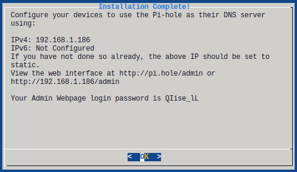

# Install and set Pi Hole on RPi

- Router: http://192.168.1.1/2.0/gui/#/login/
- Raspberry Pi 3B+
- Unbound, Pi-Hole as a recursive DNS server: https://docs.pi-hole.net/guides/dns/unbound/
- Video: https://www.youtube.com/watch?v=xtMFcVx3cHU&t=56s


### 1. Booting the Raspberry Pi

```sh
$ ssh pi@192.168.1.186

pi@picuy-hole:~ $ sudo apt -y update && sudo apt -y upgrade
```

### 2. Install Pi-Hole

- https://docs.pi-hole.net/main/basic-install/

```sh

curl -sSL https://install.pi-hole.net | bash

```

When prompting, choose these options:

1. Pi-hole is a SERVER so it needs a STATIC IP ADDRESS: Continue
2. Select Upstream DNS Provider: Google (ECS, DNSSEC)
3. Blocklists: StevenBlack's Unified Hosts List
4. Admin Web Interface: Yes
5. Web Server - lighttpd and PHP modules: Yes
6. Enable Logging: Yes
7. Select a privacy mode for FTL: Show everything
8. Copy the generated admin password or create a new one using the `pihole` client from terminal as stated in the terminal:



```sh
...
  [i] Pi-hole blocking will be enabled
  [i] Enabling blocking
  [✓] Reloading DNS lists
  [✓] Pi-hole Enabled
  [i] Web Interface password: QIise_lL
  [i] This can be changed using 'pihole -a -p'

  [i] View the web interface at http://pi.hole/admin or http://192.168.1.186/admin

  [i] You may now configure your devices to use the Pi-hole as their DNS server
  [i] Pi-hole DNS (IPv4): 192.168.1.186
  [i] If you have not done so already, the above IP should be set to static.

  [i] The install log is located at: /etc/pihole/install.log
  [✓] Installation complete! 
```

Changin the password:
```sh
pi@picuy-hole:~ $ pihole -a -p 
Enter New Password (Blank for no password): 
Confirm Password: 
  [✓] New password set
```

### 3. Check Pi-Hole installation

Open the URL `http://picuy-hole.local/admin` or `http://192.168.1.186/admin` in a browser.

### 4. Post installation - Recursive DNS

- https://docs.pi-hole.net/guides/dns/unbound/

#### 4.1. Install Unbound

```sh
pi@picuy-hole:~ $ sudo apt install unbound
```
Once installed, we will get an error because we don't have `unbound` configuration.
```sh
$ sudo nano /etc/unbound/unbound.conf.d/pi-hole.conf
```
Re-start `unbound` and check it using `dig`:
```sh
$ sudo service unbound restart

$ dig pi-hole.net @127.0.0.1 -p 5335
```

You should see this:
```sh
; <<>> DiG 9.16.33-Debian <<>> pi-hole.net @127.0.0.1 -p 5335
;; global options: +cmd
;; Got answer:
;; ->>HEADER<<- opcode: QUERY, status: NOERROR, id: 35154
;; flags: qr rd ra; QUERY: 1, ANSWER: 1, AUTHORITY: 0, ADDITIONAL: 1

;; OPT PSEUDOSECTION:
; EDNS: version: 0, flags:; udp: 1232
;; QUESTION SECTION:
;pi-hole.net.			IN	A

;; ANSWER SECTION:
pi-hole.net.		20	IN	A	3.18.136.52

;; Query time: 71 msec
;; SERVER: 127.0.0.1#5335(127.0.0.1)
;; WHEN: Mon Jan 16 20:02:18 CET 2023
;; MSG SIZE  rcvd: 56
```

#### 4.2. Update Pi-Hole configuration with Unbound

Just follow the Unbound documentation (https://docs.pi-hole.net/guides/dns/unbound/).

Go to `Pi-Hole` > `Settings` > `DNS` and Disable `IPv4` and `IPv6` and add this value `127.0.0.1#5335` to `Custom 1(IPv4)`.
Save it.

## Blocking 

### 1. Social Networks

These domains should be added to blacklist as all wildcards.

1. Youtube: 
  - youtube.com
  - googlevideo.com
2. TikTok
  - https://coygeek.com/docs/pihole-tiktok/
  - https://github.com/danhorton7/pihole-block-tiktok
3. Instagram 
  - instagram.com
  - cdninstagram.com
4. Facebook
  - facebook.com
5. Instagram & Facebook blacklist
  - https://www.reddit.com/r/pihole/comments/8l15qk/completely_block_facebook_use_instagram_howto/

### 2. Blocklist collection

- https://firebog.net/
- https://github.com/jmdugan/blocklists/


## Troubleshooting


__1. Error with `perl` and `$LC_*`__

```sh
...
apt-listchanges: Can't set locale; make sure $LC_* and $LANG are correct!
perl: warning: Setting locale failed.
perl: warning: Please check that your locale settings:
	LANGUAGE = (unset),
	LC_ALL = (unset),
	LC_TIME = "es_ES.UTF-8",
	LC_MONETARY = "es_ES.UTF-8",
	LC_ADDRESS = "es_ES.UTF-8",
	LC_TELEPHONE = "es_ES.UTF-8",
	LC_NAME = "es_ES.UTF-8",
	LC_MEASUREMENT = "es_ES.UTF-8",
	LC_IDENTIFICATION = "es_ES.UTF-8",
	LC_NUMERIC = "es_ES.UTF-8",
	LC_PAPER = "es_ES.UTF-8",
	LANG = "en_GB.UTF-8"
    are supported and installed on your system.
perl: warning: Falling back to a fallback locale ("en_GB.UTF-8").
locale: Cannot set LC_ALL to default locale: No such file or directory
```

