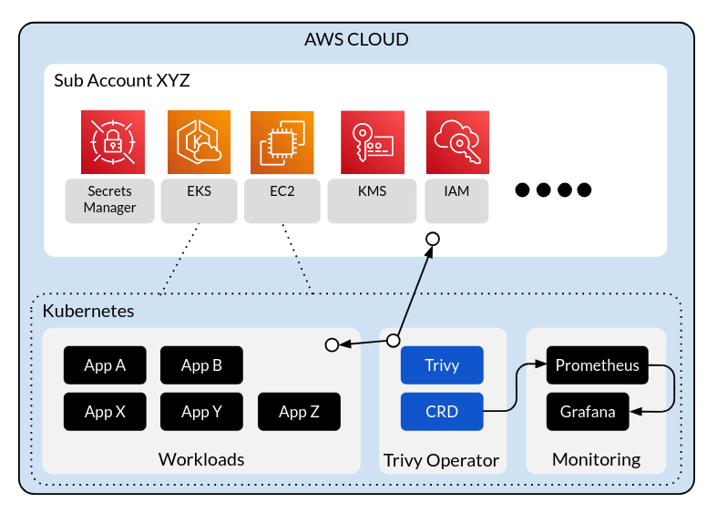

# Trivy Operator on Microk8s

- https://aquasecurity.github.io/trivy-operator/v0.23.0/tutorials/microk8s/
- https://microk8s.io/docs/security-trivy


## 0. How Trivy Operator works



## 1. Install Microk8s

- https://microk8s.io/docs/getting-started

```sh
sudo snap install microk8s --classic

sudo usermod -a -G microk8s $USER
mkdir -p ~/.kube
chmod 0600 ~/.kube

# You will also need to re-enter the session for the group update to take place:
su - $USER

microk8s status --wait-ready
microk8s enable dashboard

# Start, stop
microk8s start
microk8s stop
```

### 1.1. Install kubectl and plugin manager (optional)

- https://krew.sigs.k8s.io/docs/user-guide/setup/install/

### 1.2. Merge all kubeconfigs

```sh
cp ~/.kube/config ~/.kube/config.20250204
microk8s config > ~/.kube/config.microk8s 
export KUBECONFIG=~/.kube/config:~/.kube/config.microk8s
kubectl config view --flatten > all-in-one-kubeconfig.yaml
mv all-in-one-kubeconfig.yaml ~/.kube/config
```
Verify if works
```sh
kubectl config get-clusters
kubectl config get-contexts

CURRENT   NAME                      CLUSTER                                                 AUTHINFO                                                NAMESPACE
 *        microk8s                  microk8s-cluster                                        foo-usr                                                   
          acme-k8s-ctx              acme-k8s-cluster                                        acme-k8s-usr      

kubectl config use-context <my-context>
```

## 2. Install Trivy Operator


### 2.1. Install Trivy Operator

**Select k8s cluster by selecting context**
```sh
$ kubectl config use-context microk8s
```

**Add Helm repo**
```sh
$ helm repo add aqua https://aquasecurity.github.io/helm-charts/
$ helm repo update
```

**Install**
```sh
helm install trivy-operator aqua/trivy-operator -n trivy-system -create-namespace --version 0.25.0 --values ./trivy-operator-cfg/values-trivy-operator.yaml --debug 

helm install trivy-operator aqua/trivy-operator -n trivy-system --create-namespace --version 0.25.0 -f ./trivy-operator-cfg/values-trivy-operator.yaml 

## List installed chart
$ helm list -n trivy-system

NAME            NAMESPACE       REVISION        UPDATED                                 STATUS          CHART                   APP VERSION
trivy-operator  trivy-system    1               2025-02-04 22:40:07.107265491 +0100 CET deployed        trivy-operator-0.25.0   0.23.0 

$ kubectl get deployment -n trivy-system
```

**Update**
```sh
helm upgrade trivy-operator aqua/trivy-operator -n trivy-system --create-namespace --version 0.25.0 -f ./trivy-operator-cfg/values-trivy-operator.yaml 
```

**Checking Trivy Operator**

```sh
kubectl logs -n trivy-system deployment/trivy-operator

kubectl get crd | sed -En 's/\.aquasecurity\.github\.io\s+.*//p'

clustercompliancereports
clusterconfigauditreports
clusterinfraassessmentreports
clusterrbacassessmentreports
clustersbomreports
clustervulnerabilityreports
configauditreports
exposedsecretreports
infraassessmentreports
rbacassessmentreports
sbomreports
vulnerabilityreports

## Getting the list and summary of all reports
## Cluster-based assessments
$ kubectl get clustercompliancereports -o wide
$ kubectl get clusterconfigauditreports -o wide
$ kubectl get clusterinfraassessmentreports -o wide
$ kubectl get clusterrbacassessmentreports -o wide
$ kubectl get clustersbomreports -o wide
$ kubectl get clustervulnerabilityreports -o wide
## Namespace-based assessments
$ kubectl get configauditreports --all-namespaces -o wide | wc -l
$ kubectl get exposedsecretreports --all-namespaces -o wide | wc -l
$ kubectl get infraassessmentreports --all-namespaces -o wide | wc -l
$ kubectl get rbacassessmentreports --all-namespaces -o wide | wc -l
$ kubectl get sbomreports --all-namespaces -o wide | wc -l
$ kubectl get vulnerabilityreports --all-namespaces -o wide | wc -l
```

### 2.2. Deploy more sample applications

```sh
kubectl create namespace k8s-bootcamp 
kubectl create deployment kubernetes-bootcamp --image=gcr.io/google-samples/kubernetes-bootcamp:v1 -n k8s-bootcamp

## Get all vulns reports

kubectl get vulnerabilityreports -A -o wide

NAMESPACE      NAME                                                              REPOSITORY                           TAG       SCANNER   AGE   CRITICAL   HIGH   MEDIUM   LOW   UNKNOWN
k8s-bootcamp   replicaset-kubernetes-bootcamp-68cfbdbb99-kubernetes-bootcamp     google-samples/kubernetes-bootcamp   v1        Trivy     61s   76         210    165      18    22
kube-system    daemonset-calico-node-calico-node                                 calico/node                          v3.25.1   Trivy     44m   7          44     76       58    0
kube-system    daemonset-calico-node-install-cni                                 calico/cni                           v3.25.1   Trivy     44m   30         120    183      3     0
kube-system    daemonset-calico-node-upgrade-ipam                                calico/cni                           v3.25.1   Trivy     44m   30         120    183      3     0
kube-system    replicaset-558b69684c                                             calico/kube-controllers              v3.25.1   Trivy     44m   7          29     40       1     0
kube-system    replicaset-9b59b5f74                                              kubernetesui/metrics-scraper         v1.0.8    Trivy     44m   4          37     27       1     0
kube-system    replicaset-coredns-7896dbf49-coredns                              coredns/coredns                      1.10.1    Trivy     44m   4          18     25       1     0
kube-system    replicaset-kubernetes-dashboard-7d869bcd96-kubernetes-dashboard   kubernetesui/dashboard               v2.7.0    Trivy     40m   4          29     27       0     0
kube-system    replicaset-metrics-server-df8dbf7f5-metrics-server                metrics-server/metrics-server        v0.6.3    Trivy     44m   4          16     23       0     1
trivy-system   replicaset-trivy-operator-667d769f4b-trivy-operator               aquasec/trivy-operator               0.23.0    Trivy     25m   2          2      2        1     0
```

### 2.3. Integrating with Grafana/Prometheus

```sh
kubectl create ns monitoring
helm repo add prometheus-community https://prometheus-community.github.io/helm-charts
helm repo update

helm upgrade --install prom prometheus-community/kube-prometheus-stack -n monitoring --values ./trivy-operator-cfg/values-prom-stack.yaml
```

**Check Prom Stack installation status**
```sh
kubectl --namespace monitoring get pods -l "release=prom"
```

**Get Grafana 'admin' user password**
```sh
kubectl --namespace monitoring get secrets prom-grafana -ojsonpath="{.data.admin-password}" | base64 -d ; echo

prom-operator
```

**Forward Prometheus and Grafana ports**
```sh
kubectl port-forward service/prom-kube-prometheus-stack-prometheus -n monitoring 9090:9090
kubectl port-forward service/prom-grafana -n monitoring 3000:80
```

**Forward Trivy Operator port**
```sh
kubectl port-forward service/trivy-operator -n trivy-system 5000:80
```

**Open next urls in your browser**
* Grafana: http://tawa.local:3000 
* Prometheus: http://tawa.local:9090


### 2.4. Uninstall Trivy Operator

```sh
## Make sure you are in your K8s cluster
kubectl config get-contexts 
kubectl config use-context microk8s

## Uninstall
helm uninstall trivy-operator -n trivy-system

## Remove the CRDs

kubectl delete crd vulnerabilityreports.aquasecurity.github.io
kubectl delete crd exposedsecretreports.aquasecurity.github.io
kubectl delete crd configauditreports.aquasecurity.github.io
kubectl delete crd clusterconfigauditreports.aquasecurity.github.io
kubectl delete crd rbacassessmentreports.aquasecurity.github.io
kubectl delete crd infraassessmentreports.aquasecurity.github.io
kubectl delete crd clusterrbacassessmentreports.aquasecurity.github.io
kubectl delete crd clustercompliancereports.aquasecurity.github.io
kubectl delete crd clusterinfraassessmentreports.aquasecurity.github.io
kubectl delete crd sbomreports.aquasecurity.github.io
kubectl delete crd clustersbomreports.aquasecurity.github.io
kubectl delete crd clustervulnerabilityreports.aquasecurity.github.io
```

### 2.5. Install the Trivy Operator Grafana Dashboards


Open Grafana in your browser and import the next Dashboards:
1. Trivy Operator Dashboard
  - Basic Dashboard that allows to explore vulnerabilities, misconfigs, rbac config and secrets. 
  - https://grafana.com/grafana/dashboards/17813-trivy-operator-dashboard/
2. Trivy Operator - Vulnerabilities
  - Rich Dashboard and include detailed findings for all K8s resources assessed.
  - https://grafana.com/grafana/dashboards/16337-trivy-operator-vulnerabilities/


## 3. Update Microk8s to play with sample applications

* [setup-microk8s-and-sample-apps.md](setup-microk8s-and-sample-apps.md)